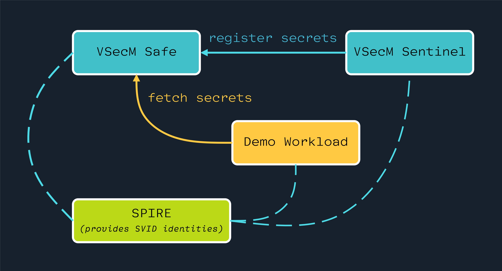

```text
|   Protect your secrets, protect your sensitive data.
:   Explore VMware Secrets Manager docs at https://vsecm.com/
</
<>/ keep your secrets... secret
```

The VMware Secrets Manager (VSecM) architecture consists of the following
main system components:

* [SPIRE][spire]: Acting as the identity control plane.
* **VSecM Safe**: The secure secrets store.
* **VSecM Sentinel**: Entry point to the system where secrets can be registered
  to the workloads.



For more details, [you can view the full architecture documentation here][architecture].

[spire]: https://spiffe.io/downloads/ "SPIRE"
[architecture]: https://vsecm.com/docs/architecture "VSecM Architecture"
