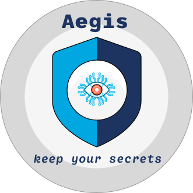

# Contributing

Thank you for your interest in contributing to **Aegis**! 

We appreciate any help, be it in the form of code, documentation, design, 
or even bug reports and feature requests. 

When contributing to this repository, please first discuss the change you wish to make 
via an issue, email, or any other method before making a change. 
This way, we can avoid misunderstandings and wasted effort.

Please note that [we have a code of conduct](CODE_OF_CONDUCT.md). We expect all 
contributors to adhere to it in all interactions with the project.

## Pull Request Process

1. Ensure all components build and function properly on a local Kubernetes cluster (*such as minikube*).
2. Adhere to the code standards described below.
3. Update necessary `README.md` and other related documents to reflect your changes.
4. Keep pull requests as granular as possible. Reviewing large amounts of code 
   can be error-prone and time-consuming for the reviewers.
6. Engage in the discussion under the pull request and proceed accordingly.

### Code Standards

In **Aegis**, we aim for a unified and clean codebase. When contributing, please try to match 
the style of the code that you see in the file you're working on. The file should look as 
if it was authored by a single person after your changes.

For Go files, we require that you run `gofmt` before submitting your pull 
request to ensure consistent formatting.

### Testing

Before submitting your pull request, make sure your changes pass all the 
existing tests, and add new ones if necessary. 

## Building Aegis for Development

To build **Aegis** from source code and develop locally, [follow the contributing guidelines here][contributing].

If you are a maintainer, and you are preparing a release, [follow the release guidelines here][release].

[contributing]: https://aegis.ist/docs/contributing/
[release]: https://aegis.ist/release/
