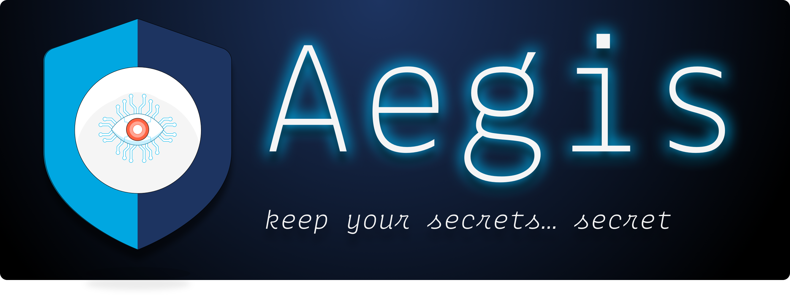

## Aegis Web

This is the source code for https://aegis.ist

[Check out **Aegis**’ website][aegis-web] for more information about the project,
high level design, contributing guidelines, and code of conduct.

[aegis-web]: https://aegis.ist/ "Aegis"
[aegis]: https://github.com/shieldworks/aegis "Aegis"
[aegis-readme]: https://github.com/shieldworks/aegis/blob/main/README.md "Aegis README"

## A Note on Security

We take **Aegis**’ security seriously. If you believe you have found a vulnerability,
please responsibly disclose by contacting [security@aegis.ist](mailto:security@aegis.ist).

## Links

* **Homepage**: <https://aegis.ist>
* **Documentation**: <https://aegis.ist/docs/>
* **Changelog**: <https://aegis.ist/changelog/>
* **Community**: [**Join Aegis’ Slack Workspace**][slack-invite]
* **Contact**: <https://aegis.ist/contact/>
* **Media Kit**: <https://aegist.ist/media/>

## License

**Aegis** documentation is distributed under [CC-BY-4.0][cc-by-40].

Non-documentation parts of this repository is distributed under the
[MIT License](LICENSE).

[cc-by-40]: https://creativecommons.org/licenses/by/4.0/ "Attribution 4.0 International (CC BY 4.0)"

[slack-invite]: https://join.slack.com/t/aegis-6n41813/shared_invite/zt-1myzqdi6t-jTvuRd1zDLbHX0gN8VkCqg "Join aegis.slack.com"
